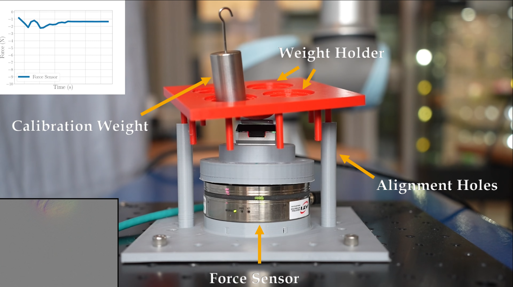

<div align="center">
  
</div>
<br>

<h4 align="center">
  FeelAnyForce: Estimating Contact Force Feedback from Tactile Sensation for Vision-Based Tactile Sensors
</h4>

<div align="center">
  <a href="https://prg.cs.umd.edu/FeelAnyForce"><b>Website</b></a> |
  <a href="https://arxiv.org/abs/2410.02048"><b>Arxiv</b></a> |
  <a href="https://www.youtube.com/watch?v=IfQCkUj2xbU"><b>YouTube</b></a>
</div>

## Table of Contents

- [Update](#update)
- [Installation](#gear-installation)
- [Real-Time prediction on GelSight Mini](#-Real-Time-prediction-on-GelSight-Mini)
- [Calibration](#-Calibration)
- [Citing this paper](#citing-this-paper)

## Update
- 01/30/25 Accepted to ICRA25!
- 03/01/25 Data release
- 03/24/25 First release of the code
## :gear: Installation

### :one: Clone this repository
To clone this repository you can launch the following command
```bash
git clone https://github.com/prgumd/FeelAnyForce.git
cd FeelAnyForce
```

### :two: Create and activate the virtual environment
To create and activate the virtual environment to work with this repository you can launch the following command
```bash
conda env create -f env.yml
conda activate anyforce_env
```

or
```bash
virtualenv anyforce_env
source anyforce_env/bin/activate
pip install -r requirements.txt
```

### :three: Download the data
Create dataset folder and download the data with

```bash
bash dataset_downloader.sh
```

### :four: Training from scratch
To train the network,
```bash
python training_multi_head.py --epochs 100 --labels_train ./dataset/TacForce_train_set.csv --labels_val ./dataset/TacForce_val_set.csv --ckpt_dir $ckpt_dir --data_basedir ./dataset/ --training_name TacForce_v1 
``` 

## 🎬 Real-Time prediction on GelSight Mini 

```bash
wget -P ckpt/ https://huggingface.co/amirsh1376/FeelAnyForce/resolve/main/checkpoint_v1.pth.tar   # download the checkpoint
python online_test.py --checkpoint ckpt/checkpoint_v1.pth.tar
``` 

## 🩹 Calibration
To record calibration data, you can 3D print a fixture for your force sensor along with a mount that allows the tactile sensor to be attached securely to the force sensor.

We’ve designed an [indenter](https://cad.onshape.com/documents/49421fb35cd6f8baa3cf3824/w/b05d7621015714dc8ed84cee/e/5af7331f10bbd3e8d1a7921a) to replicate the indentation from a robot’s end effector. This calibration setup allows for stable indentation on the tactile sensor, ensuring the force sensor readings can stabilize. Additionally, we included placeholders for calibration weights to apply various forces on the indenter.

<div align="center">  </div>

```bash
python record_deForce.py --record_count 100 --interval 1  
``` 
> _Feel free to adjust the `--interval` and `--record_count` parameters to suit your data collection needs._

Running the script will generate a .csv file containing paths to the saved tactile and depth images, along with corresponding force readings.

### 📊 Training with Calibration Data

It’s recommended to balance your dataset for a more uniform force distribution, as discussed on the project website.

Once your calibration data is collected, you can train the model using:

```bash
python training_multi_head.py \
  --labels_train calibration_sphere/calibration.csv \
  --ckpt_dir $ckpt_dir \
  --data_basedir ./dataset/ \
  --lr_backbone 0.00001 \
  --lr_calibration 0.0001 \
  --tactile_backbone_training calibration
``` 

## Citing this paper
```bibtex
@misc{shahidzadeh2024feelanyforceestimatingcontactforce,
      title={FeelAnyForce: Estimating Contact Force Feedback from Tactile Sensation for Vision-Based Tactile Sensors}, 
      author={Amir-Hossein Shahidzadeh and Gabriele Caddeo and Koushik Alapati and Lorenzo Natale and Cornelia Fermüller and Yiannis Aloimonos},
      year={2024},
      eprint={2410.02048},
      archivePrefix={arXiv},
      primaryClass={cs.RO},
      url={https://arxiv.org/abs/2410.02048}, 
}
```
## 🧔 Maintainer

This repository is maintained by:

|                                                                                                          |                                                                             |
|:--------------------------------------------------------------------------------------------------------:|:---------------------------------------------------------------------------:|
|        [](https://github.com/AmirShahid)         |                [@AmirShahid](https://github.com/AmirShahid)                 | | | |
|    [](https://github.com/gabrielecaddeo)     |            [@gabrielecaddeo](https://github.com/gabrielecaddeo)             |


## Acknowledegments
Thanks to these great repositories: [DinoV2](https://github.com/facebookresearch/dinov2), [Dino](https://github.com/facebookresearch/dino), [Sim2Surf](https://github.com/hsp-iit/sim2real-surface-classification), [gsrobotics](https://github.com/gelsightinc/gsrobotics)
